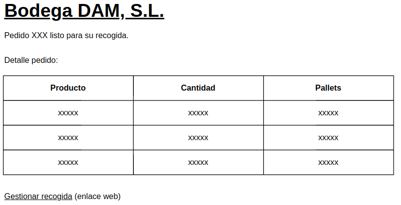
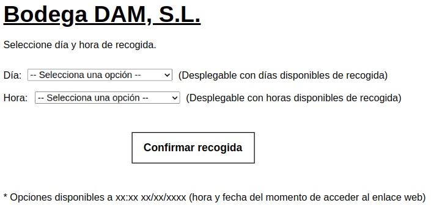

Planificar recogidas de pedidos de clientes

## Descripción detallada

El objetivo de este módulo es la planificación de la entrega de pedidos de cliente, en contacto directo con este.

Cada 12 horas se comprobará, por orden de entrada en el sistema, si los pedidos de cliente registrados están listos para su entrega (al tener suficiente stock de los productos solicitados).

En el momento que un pedido esté listo, el producto se bloqueará para dicho pedido y se le hará llegar al cliente un correo electrónico con el detalle de dicho pedido y un enlace para gestionar su recogida.

Dicho enlace le llevará a una página web con información de días y horas disponibles (en el momento que accede al enlace) por parte del almacén para realizar la entrega del pedido. El cliente seleccionará las opciones que más le interesen.

Dicha selección la registararemos en el sistema y se bloqueará ese día y hora en la planificación del almacén para no solapar entregas o recogidas de otros pedidos.

## Mapa del módulo

El módulo constará de "dos partes". 

La primera de ellas, corresponde al envío del correo electrónico al cliente informando que su pedido ya está lista para su recogida.

En dicho correo se indicará el pedido en concreto que está listo para recoger; el detalle del pedido con el detalle de los productos que lo integran, la cantidad en unidades y el número de pallets para que puedan gestionar el transporte; y un enlace donde se le direccionará a una página web para gestionar la recogida del pedido.

La segunda de ellas, corresponde a dicha página web.

En la página web se solicitará que el cliente seleccione el día y la hora de recogida poniendo a su disposición 2 listas desplegables con los días y las horas disponibles en almacén.

El cliente dispondrá de un botón para confirmar las selecciones realizadas.

Por último, hay un campo de texto donde se indica que las opciones reflejadas para el cliente son las disponibles en el momento que se accede a la web, indicando la fecha y la hora actualizada del sistema.

## Dependencias de otros módulos

- **sale_management**: gestión de pedidos de los clientes.
- **stock**: revisión cantidad de producto disponible en el almacén y su correspondiente bloqueo.

## Wireframes

### Correo

### Web

## Control de accesos: 

* Departamento de almacén
* Departamento de administración.

## Diagrama de flujos:

## Esquema relacional de nuevas tablas y relación con otras existentes:

### Nuevas tablas:

- Horario de recogida del almacén.

### Relación con otras tablas: 

- Registro de los pedidos de los clientes.
- Stock disponible en el almacén.

## Comunicación con otros módulos:

- **sale_management**: consulta.
- **stock**: consulta y modificación.

